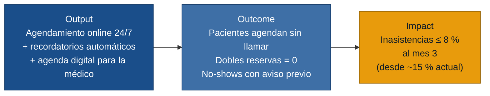

# MVP Canvas — CitaSalud

> Generado el 2026-06-18 · Fuentes: `personas.md`, `requisitos.md`, `evidence-map.json`

---

## Cadena de valor: output → outcome → impact

---

## Canvas

| Bloque | Contenido |
|---|---|
| **Propuesta de valor** | Reemplazar la agenda de papel y Excel por un sistema digital que permite a los pacientes reservar en línea las 24 h, impide dobles reservas y envía recordatorios automáticos por WhatsApp, liberando a la recepcionista de ~1,5 h diarias de llamadas y reduciendo las inasistencias que consumen tiempo médico irrecuperable. |
| **Segmento de usuarios** | Pacientes recurrentes que no pueden llamar en horario laboral (`paciente.md`); recepcionista que gestiona la agenda sin soporte digital y absorbe todo el caos operativo (`recepcionista.md`); médico que pierde tiempo por no-shows y agenda inaccesible fuera de la clínica (`doctora.md`). |
| **Funcionalidades mínimas** | 1. Agendamiento online 24/7 con selección de franja y confirmación por WhatsApp. *(R-01, R-06)* · 2. Validación de disponibilidad en tiempo real: cero dobles reservas. *(R-02)* · 3. Recordatorio automático por WhatsApp 24 h antes, con opción de cancelar desde el mensaje. *(R-03)* · 4. Vista de agenda en tiempo real para la médico, accesible desde el celular. *(R-04)* · 5. Bloqueo de franjas por la médico (congresos, vacaciones, imprevistos). *(R-07)* |
| **Resultado esperado (outcome)** | Pacientes agendan sin llamar durante su horario laboral. La recepcionista deja de hacer rondas de llamadas de recordatorio (~1,5 h/día liberadas). Las dobles reservas dejan de ocurrir. Los no-shows con aviso previo permiten reasignar la franja antes de que sea tiempo muerto. |
| **Métrica de éxito** | Tasa de inasistencia sin aviso previo ≤ 8 % al tercer mes de operación, frente al ~15 % reportado en `doctora.md`. Prueba ácida: si cae a 8 %, la médico recupera ≈ 12 min de consulta por día y puede atender un paciente adicional en la jornada — decisión de negocio clara. Si al mes 3 sigue sobre 10 %, la clínica debe evaluar agregar confirmación activa (no solo recordatorio pasivo) o depósito previo. |
| **Riesgos / supuestos** | 1. Los pacientes de la clínica usan WhatsApp activamente (respaldado por J. en `paciente.md`, pero no toda la base de pacientes es igual de joven o digital). · 2. La recepcionista abandona el cuaderno y el Excel desde el día 1 — sin uso paralelo que re-introduzca dobles reservas. · 3. El costo de la API de WhatsApp Business es asumible por una clínica pequeña. · 4. La médico define su disponibilidad base una vez al inicio y mantiene los bloqueos al día. |
| **Fuera de alcance (por ahora)** | Motivo de consulta al agendar *(US-06 — segunda fase; añade valor pero no es el cuello de botella principal)*. Gestión de múltiples médicos o especialidades. Integración con historia clínica o sistema HIS. Pagos o cobro anticipado en línea. Panel de estadísticas de ocupación para el dueño de la clínica *(no hay entrevista de primera mano de ese rol; construir para él sin evidencia directa violaría la regla de cero invención)*. |

---

## Notas de priorización

El núcleo del MVP (US-01 a US-05) ataca los tres dolores que aparecen en todas las personas:

- **Barrera telefónica** → US-01 (agendamiento online) resuelve el dolor de J. y descarga la línea de M.
- **Dobles reservas** → US-02 (validación en tiempo real) elimina el error que más cuesta en reputación.
- **No-shows e inasistencias** → US-03 (recordatorio automático) libera a M. y protege el tiempo de la Dra. S.

US-04 y US-05 son el lado de la oferta: sin ellas la médico no puede controlar su propia agenda, lo que hace inútil el sistema de cara a ella.
