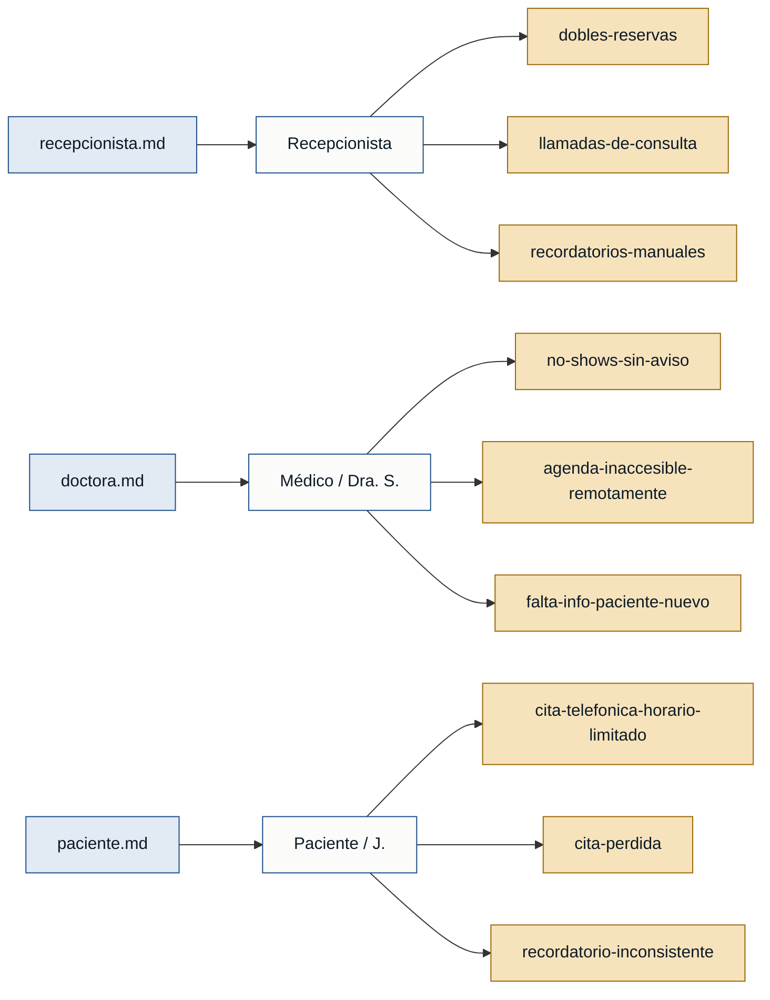

# Personas y Stakeholders — CitaSalud

> Generado el 2026-06-18 · Fuentes: `recepcionista.md`, `doctora.md`, `paciente.md`

---

## Personas

### M. (recepcionista) — Recepcionista de clínica
- **Contexto:** Administra la agenda de citas de forma manual (cuaderno + Excel) y es el único punto de contacto para reservas telefónicas.
- **Objetivo principal:** Gestionar la agenda sin errores ni interrupciones constantes, y no quedar mal con los pacientes por citas duplicadas.
- **Dolores:**
  - Dobles reservas por desincronización entre cuaderno y Excel, ~2 veces por semana. *(recepcionista.md)*
  - Un tercio de las llamadas son solo consultas informativas (horarios, disponibilidad), que interrumpen la atención presencial. *(recepcionista.md)*
  - Llamar uno a uno a los pacientes para recordatorles toma ~1,5 horas diarias; si no lo hace, aumentan las inasistencias. *(recepcionista.md)*
- **Respaldo:** `primera mano` *(recepcionista.md)*

---

### Dra. S. — Médico / prestadora del servicio
- **Contexto:** Médica general que define su propia disponibilidad (horarios, bloqueos por congresos o vacaciones); la recepcionista administra el día a día dentro de esas reglas.
- **Objetivo principal:** Aprovechar al máximo su tiempo de consulta sin huecos imprevistos, y poder consultar su agenda desde cualquier lugar.
- **Dolores:**
  - Aproximadamente el 15 % de las citas no se presentan sin avisar, generando 20–40 min de tiempo muerto irrecuperable. *(doctora.md)*
  - No puede ver su agenda fuera de la clínica; debe llamar a recepción para saber cuántos pacientes tiene al día siguiente. *(doctora.md)*
  - Los pacientes nuevos llegan sin información previa; pierde parte de la consulta averiguando el motivo básico de la visita. *(doctora.md)*
- **Respaldo:** `primera mano` *(doctora.md)*

---

### J. — Paciente recurrente
- **Contexto:** Adulto mayor (58 años) con control mensual; trabaja en horario de oficina y llama por teléfono para agendar.
- **Objetivo principal:** Sacar y confirmar citas sin interferir con su jornada laboral, y no perder el trabajo perdido por errores de agenda.
- **Dolores:**
  - Solo puede llamar en horario de almuerzo; la línea suele estar ocupada, llegando a intentarlo 4 veces para una sola cita. *(paciente.md)*
  - Su cita "no apareció" en el cuaderno al llegar, tuvo que esperar 2 horas sin haber pedido permiso previo para tanto tiempo. *(paciente.md)*
  - Los recordatorios son inconsistentes (a veces llaman, a veces no); prefiere WhatsApp porque lo revisa todo el día. *(paciente.md)*
- **Respaldo:** `primera mano` *(paciente.md)*

---

## Stakeholders

### Dueño de la clínica
- **Interés en el sistema:** Revisa los números del negocio (ocupación, ingresos); tiene interés en reducir citas perdidas y mejorar la eficiencia operativa.
- **Fuente:** *(recepcionista.md)* — mencionado por M.: "el dueño de la clínica mira los números, pero con él casi no hablo."

> ⚠️ El dueño de la clínica aparece solo **referenciado**; no existe entrevista de primera mano de ese rol. No puede respaldar personas ni requisitos por sí mismo.

---

## Mapa de trazabilidad

