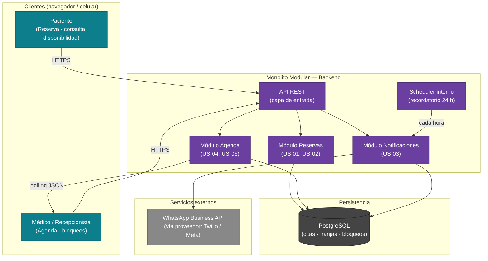

# Arquitectura — CitaSalud MVP

> Generado 2026-06-20 · Trazado a: mvp-canvas.md, requisitos.md, user-stories.md, personas.md, evidence-map.json

---

## Principio rector

**Lo más simple que funcione hoy sin hipotecar el mañana.**

Una clínica con una médica, una recepcionista y un volumen de citas que cabe en una sola base de datos relacional no necesita microservicios ni colas de mensajes distribuidas. Cada decisión de complejidad extra debe justificarse con evidencia del inbox; si no existe esa evidencia, la decisión se pospone y se registra como `open_question`.

---

## Diagrama de componentes

---

## Descripcion de componentes

### 1. Frontend unico (web responsivo)

**Que hace:** Sirve dos vistas desde la misma base de codigo: (a) vista publica para el paciente (calendario de disponibilidad, formulario de reserva) y (b) vista autenticada para la medico y la recepcionista (agenda del dia, gestion de bloqueos).

**Tecnologia candidata:** Aplicacion web con renderizado en servidor o framework SPA ligero (por ejemplo: Next.js o similar). La eleccion concreta es una `open_question` mientras no se conozca el perfil del equipo desarrollador.

**Razon:** R-08 exige acceso movil; una web responsiva cubre ese requisito sin el costo de mantener apps nativas. R-09 exige disponibilidad 24/7; con un hosting estatico o CDN el frontend no depende del backend para cargarse.

**Trazabilidad:** req:R-08 (acceso movil), req:R-09 (disponibilidad 24/7), personas.md (J. accede desde celular; Dra. S. consulta agenda desde cualquier lugar).

---

### 2. API REST (capa de entrada del monolito)

**Que hace:** Unico punto de entrada HTTP. Valida sesion, enruta la peticion al modulo correspondiente y devuelve la respuesta. No tiene logica de negocio propia.

**Tecnologia candidata:** Framework web del lenguaje que elija el equipo (decision pendiente). El contrato es JSON sobre HTTPS.

**Razon:** Una sola API simplifica el despliegue, la autenticacion y el monitoreo. No hay necesidad de un API Gateway separado en esta escala.

---

### 3. Modulo Reservas (US-01, US-02)

**Que hace:** Expone la disponibilidad de franjas, procesa nuevas reservas y aplica el bloqueo de concurrencia para impedir dobles reservas. Es el modulo de mayor criticidad del MVP.

**Mecanismo de concurrencia:** Transaccion con SELECT FOR UPDATE sobre la tabla de franjas en PostgreSQL. Ver ADR-0003.

**Trazabilidad:** US-01, US-02, req:R-01, req:R-02, req:R-06, pain `dobles-reservas` (recepcionista.md).

---

### 4. Modulo Agenda (US-04, US-05)

**Que hace:** Permite a la medico consultar el listado de citas del dia y gestionar bloqueos de franjas. Los bloqueos se persisten en la misma base de datos que las reservas, garantizando consistencia inmediata.

**Actualizacion en tiempo real:** El cliente (vista de la medico) hace polling cada 15 segundos al endpoint `/agenda`. Ver ADR-0004 y la justificacion de por que se descarta WebSocket para el MVP.

**Trazabilidad:** US-04, US-05, req:R-04, req:R-07, req:R-08, pain `agenda-inaccesible-remotamente` (doctora.md).

---

### 5. Modulo Notificaciones (US-03)

**Que hace:** Envia mensajes de WhatsApp via el proveedor de la API. Recibe eventos de dos fuentes: (a) el scheduler interno para recordatorios de 24 h, y (b) llamadas directas desde el Modulo Reservas cuando se confirma o cancela una cita.

**Trazabilidad:** US-03, req:R-03, pain `recordatorios-manuales` (recepcionista.md), pain `recordatorio-inconsistente` (paciente.md), personas.md (J. revisa WhatsApp todo el dia).

---

### 6. Scheduler interno

**Que hace:** Tarea programada (cron) que se ejecuta cada hora y consulta las citas cuya franja este a 24 h de distancia, delegando el envio al Modulo Notificaciones.

**Razon:** No se introduce un broker de mensajes (RabbitMQ, Kafka) porque el volumen de notificaciones de una clinica pequena no lo justifica. Un cron interno es suficiente y no agrega infraestructura. Ver ADR-0001.

**Trazabilidad:** US-03, mvp-canvas.md F3.

---

### 7. PostgreSQL

**Que hace:** Almacena franjas horarias, reservas, bloqueos y datos de contacto del paciente. Es la unica fuente de verdad del sistema.

**Razon:** La consistencia transaccional es no negociable (US-02). Ver ADR-0003.

**Trazabilidad:** US-02, req:R-02.

---

### 8. WhatsApp Business API (servicio externo)

**Que hace:** Canal de entrega de mensajes al paciente: confirmacion de reserva (US-01), recordatorio 24 h (US-03) y confirmacion de cancelacion (US-03).

**Razon:** Canal preferido y evidenciado por J. en paciente.md. El costo es un supuesto abierto. Ver ADR-0002.

**Trazabilidad:** US-01, US-03, req:R-03, personas.md (J.), mvp-canvas.md riesgos supuesto 3.

---

## Flujos principales

### (a) Reserva de cita (US-01 + US-02)

1. El paciente abre la vista publica en su celular, selecciona fecha y franja disponible, e ingresa su nombre y numero de WhatsApp.
2. El frontend envia `POST /reservas` al API. El Modulo Reservas abre una transaccion y ejecuta `SELECT FOR UPDATE` sobre la franja elegida.
3. Si la franja esta libre, registra la reserva y hace commit. Si esta ocupada (otro paciente la tomo en paralelo), devuelve error 409 y el frontend informa al paciente que elija otra franja.
4. Tras el commit, el Modulo Notificaciones envia un mensaje de confirmacion por WhatsApp al numero del paciente.

### (b) Recordatorio automatico 24 h antes (US-03)

1. El Scheduler interno se ejecuta cada hora y consulta `SELECT * FROM citas WHERE fecha_hora BETWEEN now()+23h AND now()+25h AND recordatorio_enviado = false`.
2. Por cada cita encontrada, llama al Modulo Notificaciones, que construye el mensaje y lo envia via WhatsApp Business API.
3. Si el proveedor confirma entrega, el sistema marca `recordatorio_enviado = true` para evitar duplicados.
4. Si el paciente responde con el codigo de cancelacion incluido en el mensaje, el webhook del proveedor notifica al Modulo Reservas, que libera la franja y actualiza el estado de la cita.

### (c) Actualizacion de agenda en tiempo real (US-04 + US-05)

1. La medico abre la vista de agenda en su celular. El frontend inicia un ciclo de polling: cada 15 segundos envia `GET /agenda?fecha=<hoy>`.
2. El Modulo Agenda consulta la base de datos y devuelve el estado actual (citas confirmadas, canceladas, bloqueos activos).
3. Cuando la medico crea un bloqueo, el frontend envia `POST /bloqueos`. El Modulo Agenda persiste el bloqueo de forma sincrona; en la siguiente respuesta al polling del paciente, esa franja ya no aparece disponible.
4. Si el feedback post-MVP muestra que 15 s de latencia es inaceptable, se escala a SSE sin cambiar la logica de negocio. Ver ADR-0004.

---

## Decisiones pendientes (open questions)

Estas preguntas no bloquean el sprint actual pero deben resolverse antes de comenzar el desarrollo.

| # | Pregunta | Por que no se decide ahora | Quien debe responderla |
|---|----------|---------------------------|------------------------|
| OQ-01 | Lenguaje y framework del backend (Node.js/Express, Python/FastAPI, Java/Spring, otro) | No hay evidencia en el inbox que favorezca uno sobre otro; depende del equipo desarrollador | Equipo tecnico al iniciar |
| OQ-02 | Proveedor concreto de WhatsApp Business API (Twilio, Meta directa, MessageBird, otro) | El costo es un supuesto no confirmado (mvp-canvas.md riesgo 3). La eleccion depende del precio y la velocidad de aprobacion de cuenta | Dueno de la clinica + equipo |
| OQ-03 | Estrategia de autenticacion para la medico y la recepcionista (usuario/contrasena, Magic Link, OAuth) | No hay requisito de autenticacion explicito en el inbox; se infiere pero no se detalla | Equipo tecnico + Product Owner |
| OQ-04 | Proveedor de hosting / infraestructura (VPS propio, PaaS como Railway o Render, nube mayor) | El presupuesto de la clinica no esta documentado en el inbox | Dueno de la clinica |
| OQ-05 | Intervalo de polling optimo para US-04 (15 s, 30 s, otro) | No hay dato de volumen de concurrencia de usuarios de la agenda. 15 s es un punto de partida razonable para validar | Equipo tecnico post-despliegue |
