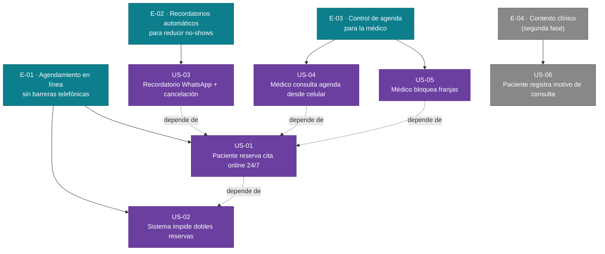

# Épicas — CitaSalud

> Generado 2026-06-20 · Trazado a: mvp-canvas.md, user-stories.md, requisitos.md, personas.md, evidence-map.json

---

## E-01 · Agendamiento en línea sin barreras telefónicas

**Valor (outcome):** Los pacientes reservan cita en cualquier momento del día sin depender del horario de atención telefónica. Las dobles reservas dejan de ocurrir (~2/semana eliminadas). La recepcionista deja de recibir llamadas de consulta de disponibilidad.

**Personas beneficiadas:** J. (paciente) · M. (recepcionista)

**Dolores que ataca:** `cita-telefonica-horario-limitado`, `cita-perdida`, `dobles-reservas`, `llamadas-de-consulta`

**Origen:** mvp-canvas.md F1, F2 · user-stories.md US-01, US-02 · requisitos.md R-01, R-02, R-06 · evidence-map.json pains[recepcionista.md, paciente.md]

**Prioridad:** 1 — Es el cuello de botella principal del MVP; sin agendamiento online nada más funciona. Ataca el dolor más frecuente de dos personas primarias y es el prerequisito técnico de todas las demás épicas.

**Historias:** US-01, US-02

---

## E-02 · Recordatorios automáticos para reducir no-shows

**Valor (outcome):** La tasa de inasistencia sin aviso baja de ~15 % hacia la meta de 8 % al tercer mes. La recepcionista recupera ~1,5 h/día que dedicaba a recordatorios manuales por teléfono. Las franjas canceladas con aviso quedan disponibles para otros pacientes.

**Personas beneficiadas:** J. (paciente) · M. (recepcionista) · Dra. S. (médico)

**Dolores que ataca:** `no-shows-sin-aviso`, `recordatorios-manuales`, `recordatorio-inconsistente`

**Origen:** mvp-canvas.md F3 · user-stories.md US-03 · requisitos.md R-03 · evidence-map.json pains[recepcionista.md, paciente.md, doctora.md]

**Prioridad:** 2 — Impacta directamente la métrica de éxito del MVP (inasistencia ≤ 8 %). Es la épica transversal: la benefician las tres personas primarias. Depende de E-01 (necesita citas agendadas para enviar recordatorios).

**Historias:** US-03

---

## E-03 · Control de agenda para la médico

**Valor (outcome):** La médico consulta su agenda completa desde el celular sin llamar a recepción. Puede bloquear franjas antes de que los pacientes las reserven, evitando conflictos y reasignaciones de último momento.

**Personas beneficiadas:** Dra. S. (médico) · M. (recepcionista)

**Dolores que ataca:** `agenda-inaccesible-remotamente`, `dobles-reservas` (via bloqueos preventivos)

**Origen:** mvp-canvas.md F4, F5 · user-stories.md US-04, US-05 · requisitos.md R-04, R-07, R-08 · evidence-map.json pains[doctora.md, recepcionista.md]

**Prioridad:** 3 — Es el lado de la oferta: sin estas historias la médico no puede controlar su propia disponibilidad, lo que erosiona la confianza en el sistema. Depende de E-01 para tener datos de agenda que mostrar.

**Historias:** US-04, US-05

---

## Candidatos de segunda fase (fuera del MVP)

### E-04 · Contexto clínico previo a la consulta

**Valor (outcome):** La médico conoce el motivo de consulta antes de que el paciente entre al consultorio, optimizando el tiempo de la cita.

**Dolores que ataca:** `falta-info-paciente-nuevo`

**Origen:** mvp-canvas.md (fuera de alcance explícito) · user-stories.md US-06 · requisitos.md R-05

**Prioridad:** 4 — Fuera del MVP por decision explícita del mvp-canvas.md ("no es el cuello de botella principal"). No hay evidencia directa de que bloquee la métrica de inasistencia.

**Historias:** US-06

---

## Diagrama Mermaid del backlog

