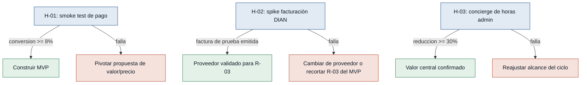

# Hipótesis y experimentos — freelancer-tools

> Supuestos extraídos de `mvp-canvas.md` (sección "Riesgos / supuestos") y
> priorizados por riesgo (impacto de equivocarse × incertidumbre), de mayor
> a menor. Cada test card responde a la pregunta: ¿cuál es la información
> más barata que puedo comprar para reducir este riesgo antes de construir
> el hub completo?

## Árbol de decisión general

---

### [H-01] Voluntad de pago real (no solo declarada) — riesgo: alto
- **Supuesto a probar:** los freelancers pagarán dinero real por una
  herramienta que resuelva el ciclo tiempo→factura→cobro, más allá de lo
  que dijeron en la entrevista.
- **Hipótesis:** Creemos que freelancers solos que facturan en Colombia
  completarán una reserva pagada real si les mostramos una landing con la
  propuesta de valor y un precio concreto, porque el dolor financiero
  cuantificado (pérdidas de $1-2 millones COP por desorganización, según
  Daniela y Felipe) ya está validado en las entrevistas.
- **Señal medible:** tasa de conversión de visitantes calificados
  (freelancers colombianos) a una reserva pagada (depósito reembolsable).
- **Criterio de éxito:** ≥8% de conversión sobre un mínimo de 150 visitas
  calificadas, en 3 semanas.
- **Experimento:** smoke test — landing con la propuesta de valor y un
  botón de pago de reserva real ($20.000-50.000 COP reembolsables),
  promovida en comunidades de freelancers colombianos.
- **Caja de tiempo/costo:** 3 semanas, hasta $300.000 COP en promoción
  dirigida.
- **Regla de decisión:** Si conversión ≥8% → perseverar y avanzar a
  construir el MVP. Si falla (conversión <8%) → pivotar la propuesta de
  valor o el precio antes de construir nada.

### [H-02] Viabilidad de facturación electrónica ante la DIAN — riesgo: alto
- **Supuesto a probar:** se puede integrar con un proveedor de facturación
  electrónica habilitado por la DIAN en un plazo y costo razonables.
- **Hipótesis:** Creemos que podemos emitir una factura electrónica válida
  vía la API de un proveedor habilitado (p. ej. Siigo o Alegra) en menos de
  10 días-persona, porque esos proveedores ya ofrecen APIs documentadas y
  los usan hoy Felipe y Marcela respectivamente.
- **Señal medible:** si el spike técnico logra emitir, en sandbox o
  certificación, una factura de prueba con IVA y retención calculados
  correctamente.
- **Criterio de éxito:** al menos 1 factura de prueba emitida y validada en
  ≤10 días-persona, con el cálculo verificado por alguien con conocimiento
  contable.
- **Experimento:** prototipo técnico desechable (spike) integrando la API
  de un proveedor en modo sandbox, sin construir el resto del hub.
- **Caja de tiempo/costo:** 10 días-persona.
- **Regla de decisión:** Si se logra dentro del plazo → perseverar con ese
  proveedor como base técnica de R-03/R-16. Si falla (no se logra, o el
  costo por transacción es prohibitivo) → evaluar otro proveedor o recortar
  R-03 del MVP inicial (solo cálculo, emisión manual).

### [H-03] Reducción real de horas administrativas — riesgo: alto
- **Supuesto a probar:** centralizar tiempo, factura y cobro reduce las
  horas administrativas semanales del freelancer, no solo traslada el
  trabajo.
- **Hipótesis:** Creemos que freelancers solos reducirán sus horas
  administrativas semanales autoreportadas en al menos 30% si reciben, de
  forma manual, el mismo servicio que el hub automatizaría, porque el dolor
  viene de la coordinación manual entre herramientas (evidencia fuerte en
  las 3 entrevistas), no de falta de disciplina personal.
- **Señal medible:** horas administrativas semanales autoreportadas
  (encuesta corta antes/después).
- **Criterio de éxito:** reducción promedio ≥30%, con al menos 5
  freelancers solos participando durante 3 semanas.
- **Experimento:** concierge / mago de oz — un operador humano centraliza
  el tiempo de 5 freelancers y les genera facturas y seguimiento de cobro
  manualmente cada semana.
- **Caja de tiempo/costo:** 3 semanas, esfuerzo del operador ≤10h/semana.
- **Regla de decisión:** Si reducción ≥30% → perseverar, el valor central
  está validado. Si falla (reducción <30%) → investigar qué parte del ciclo
  no aporta el ahorro esperado y ajustar el alcance del MVP.

### [H-04] Modelo de precio (pago único vs. suscripción) — riesgo: medio
- **Supuesto a probar:** existe un modelo de precio que funciona para el
  segmento, pese a la evidencia conflictiva entre Daniela (pago único) y
  Marcela (suscripción moderada).
- **Hipótesis:** Creemos que ofrecer ambas opciones en la misma landing no
  reducirá la conversión total frente a ofrecer solo una, porque el
  freelancer solo valora la flexibilidad tanto como la simplicidad, según
  las preferencias genuinamente distintas observadas en las entrevistas.
- **Señal medible:** tasa de conversión a reserva pagada, segmentada por
  opción de precio elegida, dentro del mismo smoke test de H-01.
- **Criterio de éxito:** al menos una variante alcanza ≥8% de conversión
  sobre un mínimo de 75 visitas calificadas por variante, en las mismas 3
  semanas del experimento de H-01.
- **Experimento:** A/B dentro del smoke test de H-01 — mitad de las visitas
  ve precio único, mitad ve suscripción mensual.
- **Caja de tiempo/costo:** sin costo adicional (mismo experimento de H-01).
- **Regla de decisión:** Si ambas superan el umbral → ofrecer las dos
  opciones. Si solo una lo supera → quedarse con esa. Si falla (ninguna
  supera el umbral) → el problema no es el precio, sino la propuesta de
  valor; revisar H-01 primero.

### [H-05] Disposición a migrar desde el stack actual — riesgo: medio
- **Supuesto a probar:** los freelancers están dispuestos a migrar su
  historial y hábito de trabajo desde Toggl/Sheets/Trello/Notion hacia una
  herramienta nueva.
- **Hipótesis:** Creemos que la mayoría de los participantes de H-01/H-03
  completarán la migración de al menos un cliente activo real dentro de la
  primera semana, porque el costo de mantener el stack actual ya supera el
  costo percibido de cambiar, según lo declarado en las 3 entrevistas.
- **Señal medible:** % de participantes del concierge (H-03) que migran al
  menos un cliente activo real dentro de los primeros 7 días.
- **Criterio de éxito:** ≥50% de los participantes migran al menos 1
  cliente activo en ≤7 días.
- **Experimento:** extensión del concierge de H-03 — se pide traer
  información de un cliente activo real para que el operador la centralice.
- **Caja de tiempo/costo:** las mismas 3 semanas de H-03, sin costo
  adicional.
- **Regla de decisión:** Si ≥50% migra → perseverar, el costo de cambio no
  es una barrera mayor. Si falla (<50% migra) → entrevistar a quienes no
  migraron para entender la fricción específica antes de invertir en
  importadores automáticos.

---

## Notas de secuenciación

- **H-01, H-02 y H-04 se pueden correr en paralelo** (mismo smoke test, 3
  semanas): H-01 mide conversión general, H-04 la segmenta por precio.
- **H-03 y H-05 se corren juntos** (mismo concierge, 3 semanas), pero son
  independientes de H-01/H-02/H-04 — se pueden lanzar simultáneamente.
- Si H-02 falla, no necesariamente mata el MVP: la regla de decisión ya
  contempla recortar R-03 (emisión electrónica) sin descartar el resto del
  hub, que sigue dependiendo de H-01 y H-03.
