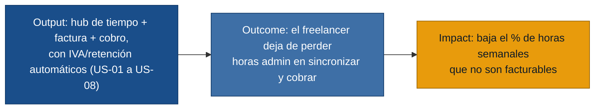

# MVP Canvas — freelancer-tools

## La cadena de valor del MVP

## MVP Canvas — Hub de tiempo, facturación y cobro para freelancer solo (Colombia)

| Bloque | Contenido |
|---|---|
| Propuesta de valor | Dejar de ser "la integradora humana" de varias herramientas: el tiempo que se registra se convierte directamente en una factura electrónica válida ante la DIAN (con IVA y retención calculados) y en visibilidad de qué está pagado, pendiente o vencido — todo en un solo lugar. |
| Segmento de usuarios | Freelancer solo, sin equipo, que factura en Colombia (validado con Daniela y Felipe). **No incluye** freelancers con equipo (Marcela) en esta primera versión — ver "Fuera de alcance". |
| Funcionalidades mínimas | US-01 (hub único tarea/tiempo/factura/nota) · US-02 (tiempo → factura automático) · US-03 (recordatorio de timer) · US-04 (horas facturables vs. admin) · US-05 (factura con IVA/retención en un paso) · US-06 (conciliación de pagos multicanal) · US-07 (dashboard de cobros) · US-08 (alerta de factura vencida) |
| Resultado esperado (outcome) | El freelancer reduce el tiempo que dedica cada semana a sincronizar herramientas, calcular facturas a mano y perseguir pagos — y dejan de perderse ingresos por datos desincronizados u olvido de facturar. |
| Métrica de éxito | Horas semanales de administración auto-reportadas por el usuario (encuesta corta pre/post). Línea base observada en las 3 entrevistas: ~15-20 de 45 horas semanales. **Meta: reducir en al menos 30% (a ~13h o menos) para usuarios con 4 semanas de uso continuo.** Si sube o no se mueve, el negocio sabe que el core loop (US-01 a US-08) no está generando el ahorro prometido y debe revisarse antes de construir más funcionalidades. |
| Riesgos / supuestos | Ver detalle en la sección siguiente. |
| Fuera de alcance (por ahora) | Ver detalle en la sección siguiente. |

## Riesgos y supuestos

- **Supuesto sin validar de mercado:** el segmento "freelancer solo que
  factura en Colombia" es suficientemente grande y homogéneo para sostener
  el producto con solo 2 entrevistas de ese segmento exacto (Daniela y
  Felipe tienen oficios distintos — diseño y desarrollo — lo que ayuda, pero
  siguen siendo n=2).
- **Riesgo regulatorio/técnico alto:** emitir factura electrónica válida
  ante la DIAN normalmente requiere integrarse con un proveedor tecnológico
  habilitado (como hacen hoy Felipe con Siigo y Marcela con Alegra) o
  convertirse en uno. Esto no es solo una funcionalidad de producto: es una
  restricción técnica y de cumplimiento que puede condicionar el cronograma
  y el costo real del MVP.
- **Riesgo de cálculo tributario:** IVA y retención en la fuente mal
  calculados no son un bug cualquiera — implican dinero real y exposición
  legal para el usuario. Antes de construir, hay que validar las reglas con
  alguien con conocimiento contable/tributario, no solo con las
  entrevistas.
- **Supuesto de adopción:** los usuarios migrarán su historial desde Toggl,
  Sheets, Trello y Notion. Ninguna entrevista profundiza en qué tan
  dispuestos están a hacer esa migración ni en qué tan doloroso les
  resultaría.
- **Modelo de precio no resuelto (evidencia en conflicto):** Daniela exige
  pago único; Marcela aceptaría suscripción moderada sin cobro por usuario;
  Felipe no se pronuncia. El MVP no asume un modelo — se debe decidir y,
  probablemente, probarse como hipótesis aparte (ver
  `requisitos.md` → "Evidencia conflictiva").
- **Punto ciego:** no hay entrevista de ningún stakeholder no-usuario
  (cliente, contador, DIAN) que confirme, desde su lado, qué necesitan de
  una factura o de un flujo de cobro. Todo lo que sabemos de ellos es
  `referenciado`.

## Fuera de alcance (por ahora)

- **Propuestas/cotizaciones automatizadas (R-07):** dolor real y
  corroborado, pero no es parte del ciclo financiero core (tiempo→factura→
  cobro). Se aborda después de validar el núcleo.
- **Guardarraíles de scope creep / gestión de contratos (R-10):**
  complementario al ciclo de facturación, no bloqueante para demostrar el
  valor central.
- **Reporte de rentabilidad por cliente/proyecto (R-11):** depende de que
  US-02/US-04 ya estén funcionando y con datos reales acumulados; tiene más
  sentido como fase 2, construido sobre datos que el MVP ya habrá empezado
  a capturar.
- **Registro de tiempo multi-contratista y coordinación de equipo (R-14,
  R-15):** evidencia de un solo perfil (Marcela, freelancer con equipo). El
  MVP se enfoca en el freelancer solo, donde hay 2 entrevistas
  independientes que corroboran el dolor central. Ampliar a equipos es una
  extensión de producto, no del MVP inicial.
- **Exportación para contador / declaración de renta (R-13):** solo un
  entrevistado (Daniela) lo pide con detalle; no es parte del ciclo
  cobrar-por-trabajo-ya-hecho que es el foco del MVP.
- **Portabilidad completa de datos (R-17):** importante para la confianza a
  largo plazo, pero no bloquea la demostración de valor inicial; se
  resuelve antes del lanzamiento comercial, no antes del primer
  experimento.
- **Definición final del modelo de precio (R-19):** decisión de negocio
  pendiente por evidencia conflictiva; no se fija en este canvas.
- **Comunicación de clientes centralizada (comunicacion-clientes-dispersa):**
  dolor real de Marcela (freelancer con equipo), sin corroborar en el
  segmento freelancer solo que es el foco de este MVP.
