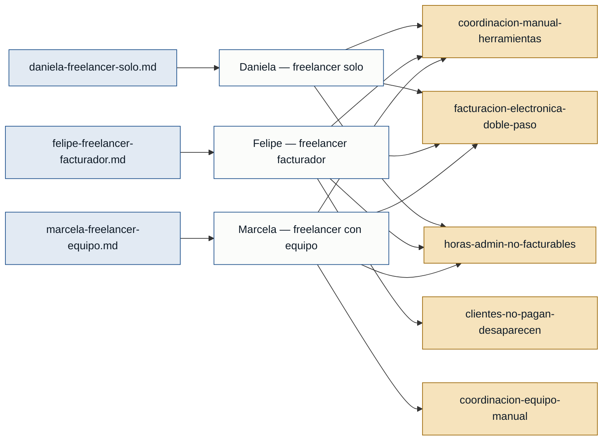

# Personas y stakeholders — freelancer-tools

> Evidencia: 3 entrevistas en primera persona —
> `daniela-freelancer-solo.md`, `felipe-freelancer-facturador.md`,
> `marcela-freelancer-equipo.md`. Las tres cubren perfiles distintos de
> freelancer en Colombia, lo que permite corroborar dolores compartidos y
> detectar dolores específicos de cada segmento.

## Mapa de trazabilidad

## Personas

### Daniela — freelancer profesional independiente (sin equipo)
- **Contexto:** diseñadora UX/UI freelance, 4 años de trayectoria, 4-6
  clientes simultáneos, trabaja sola desde Bogotá. Usa un stack de
  herramientas gratuitas (Trello, Toggl, Sheets, Notion) tras abandonar
  herramientas de pago por costo acumulado de suscripciones.
  (daniela-freelancer-solo.md)
- **Objetivo principal:** dejar de ser "la integradora humana" de varias
  herramientas desconectadas para dedicar más tiempo a trabajo facturable.
  (daniela-freelancer-solo.md)
- **Dolores clave:** ver sección "Dolores compartidos" y "Dolores
  específicos" más abajo.
- **Respaldo:** `primera mano` (daniela-freelancer-solo.md)

### Felipe — freelancer solo, foco en facturación y cobro
- **Contexto:** desarrollador web freelance, 6 años de trayectoria, 2-3
  clientes grandes (proyectos de 3-6 meses), vive en Medellín. Su dolor
  central declarado es todo el ciclo de facturación y cobro, no el trabajo
  técnico. (felipe-freelancer-facturador.md)
- **Objetivo principal:** que generar y cobrar una factura sea casi
  automático, para no interrumpir el trabajo técnico y no perder ingresos
  por desorganización administrativa. (felipe-freelancer-facturador.md)
- **Dolores clave:** ver secciones de abajo.
- **Respaldo:** `primera mano` (felipe-freelancer-facturador.md)

### Marcela — freelancer con equipo pequeño (micro-agencia)
- **Contexto:** directora de una micro-agencia creativa: ella más 2
  contratistas (diseñadora, community manager). 6 clientes activos, factura
  como persona natural con actividad empresarial. Vive en Cali.
  (marcela-freelancer-equipo.md)
- **Objetivo principal:** tener visibilidad de rentabilidad por cliente y
  coordinar a su equipo sin que la carga operativa crezca exponencialmente
  al escalar. (marcela-freelancer-equipo.md)
- **Dolores clave:** ver secciones de abajo.
- **Respaldo:** `primera mano` (marcela-freelancer-equipo.md)

## Dolores compartidos (corroborados por 2 o más entrevistadas — confianza fuerte)

- **coordinacion-manual-herramientas** — vivir en múltiples herramientas
  desconectadas que hay que sincronizar a mano (4 en Daniela, 7 en Felipe,
  10 en Marcela). (daniela-freelancer-solo.md, felipe-freelancer-facturador.md,
  marcela-freelancer-equipo.md)
- **horas-admin-no-facturables** — cerca de 20 de 45 horas semanales se van
  en administración no facturable (Daniela: 20/45, Felipe: 15/45, Marcela:
  20/45). (daniela-freelancer-solo.md, felipe-freelancer-facturador.md,
  marcela-freelancer-equipo.md)
- **cambio-contexto-tareas** — saltar entre trabajo creativo/técnico y
  administración rompe el flujo y cuesta 20-30 min recuperar concentración.
  (daniela-freelancer-solo.md, felipe-freelancer-facturador.md,
  marcela-freelancer-equipo.md)
- **facturacion-electronica-doble-paso** — preparar la información en una
  hoja de cálculo y luego pasarla a un sistema de facturación electrónica
  habilitado por la DIAN (Sheets→Siigo en Felipe, Sheets→Alegra en Marcela).
  (daniela-freelancer-solo.md, felipe-freelancer-facturador.md,
  marcela-freelancer-equipo.md)
- **seguimiento-manual-pagos** — recordar manualmente quién debe, cuánto y
  desde cuándo, con hojas de cálculo que se desactualizan. (daniela-freelancer-solo.md,
  felipe-freelancer-facturador.md, marcela-freelancer-equipo.md)
- **time-tracking-inconsistente** — el registro de tiempo falla por olvido u
  omisión (Daniela olvida iniciar el timer; Felipe lo usa "a medias"; a
  Marcela y a su equipo se les llena de huecos). (daniela-freelancer-solo.md,
  felipe-freelancer-facturador.md, marcela-freelancer-equipo.md)
- **pagos-multiples-canales-latam** — conciliar pagos por Bancolombia, Nequi
  y plataformas internacionales (Payoneer/Wise) con TRM y comisiones
  variables. (daniela-freelancer-solo.md, felipe-freelancer-facturador.md,
  marcela-freelancer-equipo.md)
- **herramientas-no-localizadas-latam** — las herramientas existentes
  (AND.CO, Bonsai, HoneyBook, Productive, Teamwork, Monday.com) asumen
  facturación en USD vía Stripe y no entienden IVA, retención en la fuente
  ni facturación electrónica DIAN. (daniela-freelancer-solo.md,
  felipe-freelancer-facturador.md, marcela-freelancer-equipo.md)
- **propuestas-tiempo-perdido** — cada propuesta toma 1.5-2 horas y una
  parte importante no se convierte en proyecto. (daniela-freelancer-solo.md,
  felipe-freelancer-facturador.md, marcela-freelancer-equipo.md)
- **scope-creep** — clientes piden "una cosita más" durante el proyecto y
  termina sin cotizarse aparte. (daniela-freelancer-solo.md,
  felipe-freelancer-facturador.md, marcela-freelancer-equipo.md)
- **rentabilidad-cliente-invisible** — no hay visibilidad clara de cuánto
  cuesta realmente atender a cada cliente frente a lo que paga (Marcela
  perdió $300.000 COP/mes durante 3 meses sin saberlo con un cliente
  concreto). (felipe-freelancer-facturador.md, marcela-freelancer-equipo.md,
  daniela-freelancer-solo.md)
- **perdida-ingresos-desorganizacion** — dinero perdido por errores de
  organización: Daniela cobró de menos por datos desincronizados, Felipe
  literalmente "regaló" un entregable de 2 millones de pesos por olvidar
  facturarlo, Marcela paga de más a contratistas o cobra de menos al cliente
  por estimar en vez de medir. (daniela-freelancer-solo.md,
  felipe-freelancer-facturador.md, marcela-freelancer-equipo.md)
- **carga-mental-constante** — la imposibilidad de "desconectar" porque
  siempre hay algo administrativo pendiente en la cabeza (Felipe: carga
  mental explícita; Marcela: burnout y tendencia a expandir el trabajo para
  llenar el tiempo libre). (felipe-freelancer-facturador.md,
  marcela-freelancer-equipo.md)
- **anticipos-contratos-proteccion** — cobrar anticipo y definir hitos de
  pago como mecanismo de protección ante impago (Felipe: mínimo 25-50% en
  hitos; Daniela: 30% anticipado). (felipe-freelancer-facturador.md,
  daniela-freelancer-solo.md)
- **aislamiento-profesional** — sensación de aislamiento al trabajar de
  forma independiente, incluso con equipo (Daniela: mención breve; Marcela:
  extraña la colaboración presencial de una agencia grande, a pesar de
  tener equipo remoto). (daniela-freelancer-solo.md, marcela-freelancer-equipo.md)

## Dolores específicos de una sola persona (confianza moderada o débil)

- **consolidacion-contabilidad** — preparar información para el contador
  toma ~2 días y a veces tiene errores. (daniela-freelancer-solo.md) — moderada
- **desconfianza-proveedor-unico** — desconfianza en herramientas hechas por
  un solo desarrollador que pueden desaparecer (le pasó, perdió 3 meses de
  registros). (daniela-freelancer-solo.md) — moderada
- **automatizacion-fragil** — un zap de Zapier dejó de sincronizar bien tras
  2 semanas de uso. (daniela-freelancer-solo.md) — débil
- **disputa-plataforma-freelance** — una plataforma de freelance falló a
  favor del cliente en una disputa después de entregado el trabajo; Felipe
  dejó de usar plataformas por eso. (felipe-freelancer-facturador.md) — moderada
- **facturacion-electronica-costosa-sobredimensionada** — paga ~$60.000
  COP/mes por Siigo, una herramienta de facturación electrónica con
  funciones de contabilidad empresarial que no necesita. (felipe-freelancer-facturador.md) — moderada
- **clientes-no-pagan-desaparecen** — un cliente recibió el trabajo
  terminado y desapareció sin pagar ($5 millones COP perdidos). (felipe-freelancer-facturador.md) — moderada
- **coordinacion-equipo-manual** — coordinar contratistas (revisar
  entregables, dar feedback) sin herramientas dedicadas consume ~5
  horas/semana. (marcela-freelancer-equipo.md) — moderada
- **pago-contratistas-basado-en-estimacion** — como los contratistas no
  trackean tiempo de forma consistente, Marcela termina estimando cuánto
  pagarles, casi siempre de más. (marcela-freelancer-equipo.md) — moderada
- **comunicacion-clientes-dispersa** — cada cliente usa un canal distinto
  (correo, WhatsApp, Slack); un mensaje perdido causó rehacer un diseño
  completo. (marcela-freelancer-equipo.md) — moderada
- **limite-escalar-sin-infraestructura** — no puede crecer el equipo o la
  cartera de clientes porque la carga administrativa ya está al límite.
  (marcela-freelancer-equipo.md) — moderada

## Stakeholders

### Clientes (empresas y personas, nacionales e internacionales)
- **Interés en el sistema:** recibir entregables a tiempo, facturas
  correctas y, en el caso de personas jurídicas, aplicar correctamente
  retenciones. Pagan por distintos canales y algunos a 30-45 días.
- **Fuente:** referenciados en las 3 entrevistas, sin entrevista propia.
  `referenciada`

### Contratistas de un freelancer con equipo (diseñadora, community manager)
- **Interés en el sistema:** que sus horas se registren y paguen
  correctamente; hoy sus registros son inconsistentes y Marcela termina
  estimando su pago.
- **Fuente:** marcela-freelancer-equipo.md, sin entrevista propia.
  `referenciada`

### Contador
- **Interés en el sistema:** recibir información contable/tributaria
  completa y ordenada para la declaración de renta.
- **Fuente:** daniela-freelancer-solo.md, sin entrevista propia.
  `referenciada`

### DIAN (autoridad tributaria colombiana) — regulador
- **Interés en el sistema:** exige facturación electrónica habilitada,
  cálculo correcto de IVA (19%) y retenciones en la fuente.
- **Fuente:** mencionada en las 3 entrevistas como restricción regulatoria,
  sin entrevista propia. `referenciada`

---

## Advertencia de cobertura

- Las **3 personas primarias tienen respaldo `primera mano`** — el
  discovery ya no depende de una sola entrevistada.
- Los stakeholders (clientes, contratistas, contador, DIAN) siguen siendo
  todos `referenciados`, sin entrevista directa. Esto es aceptable para
  stakeholders no-usuarios, pero limita la profundidad de requisitos
  relacionados con la experiencia de un contratista dentro del sistema
  (persona secundaria potencial, hoy sin voz propia).
- Los tres perfiles cubren un espectro razonable del segmento
  "freelancer/micro-agencia en Colombia", pero todos están en Colombia y en
  industrias creativas/técnicas. No hay evidencia de otros países
  latinoamericanos ni de otros regímenes tributarios.
