# Arquitectura del MVP — freelancer-tools

## Visión general

El MVP es un **hub centralizado** que consolida la gestión de tiempo, facturación y cobros en un único lugar, eliminando la coordinación manual entre herramientas desconectadas (Trello, Toggl, Sheets, Siigo/Alegra).

**Principio de diseño:** Lo más simple que funcione. Cada componente responde directamente a un requisito del backlog (R-01 a R-09, R-16, R-18). Lo que no está en las historias del MVP (R-07, R-10, R-11, R-12, R-14, R-15, R-17, R-19 y fase 2) **no se diseña ahora**.

---

## Diagrama de componentes

```mermaid
graph TB
    classDef frontend fill:#4F46E5,color:#fff,stroke:#312E81,stroke-width:2px;
    classDef backend fill:#06B6D4,color:#fff,stroke:#164E63,stroke-width:2px;
    classDef data fill:#8B5CF6,color:#fff,stroke:#3F0F5C,stroke-width:2px;
    classDef external fill:#EF4444,color:#fff,stroke:#7F1D1D,stroke-width:2px;
    classDef job fill:#F59E0B,color:#fff,stroke:#78350F,stroke-width:2px;
    classDef phase2 fill:#D1D5DB,color:#333,stroke:#4B5563,stroke-width:2px,stroke-dasharray: 5 5;

    subgraph "Cliente (Frontend)"
        UI["React/Vue SPA<br/>- Hub de tareas/tiempo<br/>- Crear facturas<br/>- Registrar pagos<br/>- Dashboard de cobros"]:::frontend
    end

    subgraph "API Backend (Node.js + Express)"
        Auth["Auth Service<br/>OAuth2 + Google"]:::backend
        TaskSvc["Task Service<br/>Clientes, Proyectos<br/>Tareas (To Do/In Progress/Done)"]:::backend
        TimeSvc["Time Service<br/>Time entries<br/>Clasificación facturable/admin"]:::backend
        InvoiceSvc["Invoice Service<br/>Precarga de horas<br/>Cálculo IVA 19%<br/>Generación borrador/emitida"]:::backend
        PaymentSvc["Payment Service<br/>Registro manual pagos<br/>Conciliación<br/>Cálculo saldo pendiente"]:::backend
        DashboardSvc["Dashboard Service<br/>Totales: facturado<br/>cobrado, pendiente, vencido"]:::backend
        NotifSvc["Notification Service<br/>In-app notifications<br/>Email (OPT-IN)"]:::backend
    end

    subgraph "Data Layer"
        DB["PostgreSQL<br/>- Clientes<br/>- Proyectos<br/>- Tareas<br/>- Time entries<br/>- Invoices<br/>- Payments<br/>- Users (auth)"]:::data
        Cache["In-memory cache<br/>(opcional MVP)<br/>para dashboard"]:::data
    end

    subgraph "Job Scheduler"
        JobQ["BullMQ / Node-cron<br/>Trigger alertas 00:00<br/>Factura vencida"]:::job
    end

    subgraph "Integraciones Futuras (Fase 2)"
        DIAN["DIAN Integration<br/>(proveedor habilitado)<br/>Retención en la fuente<br/>Firma digital"]:::phase2
        TRM["TRM Integration<br/>Fuente automática<br/>Actualización diaria"]:::phase2
        Bank["Bancaria Integration<br/>Conciliación automática<br/>Bancolombia, Nequi"]:::phase2
    end

    UI -->|HTTP API| Auth
    UI -->|HTTP API| TaskSvc
    UI -->|HTTP API| TimeSvc
    UI -->|HTTP API| InvoiceSvc
    UI -->|HTTP API| PaymentSvc
    UI -->|HTTP API| DashboardSvc
    UI -->|WebSocket| NotifSvc

    Auth -->|Read/Write| DB
    TaskSvc -->|Read/Write| DB
    TimeSvc -->|Read/Write| DB
    InvoiceSvc -->|Read/Write| DB
    PaymentSvc -->|Read/Write| DB
    DashboardSvc -->|Read| DB
    DashboardSvc -->|Read/Write| Cache
    NotifSvc -->|Read/Write| DB
    NotifSvc -->|Email| Email["Email Provider<br/>(SendGrid/Resend)<br/>OPT-IN only"]:::external

    JobQ -->|Read| DB
    JobQ -->|Trigger| NotifSvc

    DIAN -.->|Phase 2| InvoiceSvc
    TRM -.->|Phase 2| PaymentSvc
    Bank -.->|Phase 2| PaymentSvc
```



---

## Stack técnico

### Frontend
- **Framework:** React 18+ (hipótesis: usuarios de Daniela, Felipe, Marcela requieren UX responsiva, componentes reutilizables)
- **Lenguaje:** TypeScript
- **Gestión de estado:** TanStack Query (React Query) + Zustand (estado global simple)
- **Estilos:** Tailwind CSS
- **Build:** Vite (desarrollo rápido)
- **Deployment:** Vercel / AWS Amplify

### Backend
- **Runtime:** Node.js 20+
- **Framework:** Express.js + TypeScript
- **Autenticación:** Passport.js (OAuth2 + Google)
- **Validación:** Zod / Joi
- **ORM:** Sequelize o TypeORM (PostgreSQL)
- **Job Queue:** BullMQ (Redis-backed) o node-cron (si no justifica Redis)
- **Logging:** Winston / Pino
- **API Docs:** Swagger/OpenAPI

### Data Layer
- **Base de datos:** PostgreSQL 14+
  - ACID transactions (crítico para pagos e invoices)
  - Soporte de enumerables (estados de tarea, tipo de pago)
  - Indices en columnas de filtrado frecuente (cliente_id, período)
- **Cache (opcional MVP):** Redis (solo si dashboard muestra latencia >500ms en query de totales)

### Hosting / DevOps
- **Staging + Production:** AWS (RDS for PostgreSQL, EC2 o Fargate para API)
  - Alternativa: DigitalOcean App Platform (más simple para MVP)
- **CDN:** CloudFront / Vercel Edge (para assets estáticos)
- **Monitoreo:** CloudWatch / Datadog (logs, trazas)
- **CI/CD:** GitHub Actions

---

## Entidades principales (Modelo de datos MVP)

```
User (auth)
├── id (PK)
├── email (unique, from OAuth Google)
├── name
├── preferences (gracia_dias_alerta, email_notifications_opted_in)
└── created_at, updated_at

Client
├── id (PK)
├── user_id (FK)
├── name
├── hourly_rate (tarifa por defecto en COP)
├── invoice_due_days (plazo de pago)
└── created_at, updated_at

Project
├── id (PK)
├── user_id (FK)
├── client_id (FK)
├── name
├── scope_description
├── included_revisions (para fase 2)
└── created_at, updated_at

Task
├── id (PK)
├── user_id (FK)
├── project_id (FK)
├── title
├── status (enum: 'to_do', 'in_progress', 'done')
└── created_at, updated_at

TimeEntry
├── id (PK)
├── user_id (FK)
├── task_id (FK)
├── client_id (FK)
├── project_id (FK) [denorm para query rápida]
├── start_time
├── end_time (nullable si activo)
├── duration_hours (computed)
├── type (enum: 'billable', 'admin')
├── notes
└── created_at, updated_at

Invoice
├── id (PK)
├── user_id (FK)
├── client_id (FK)
├── invoice_number (unique per user)
├── status (enum: 'draft', 'emitted', 'cancelled')
├── subtotal_cop (suma de horas * tarifa)
├── iva_amount_cop (subtotal * 0.19)
├── total_cop (subtotal + iva)
├── issue_date
├── due_date (issue_date + client.invoice_due_days)
├── notes
└── created_at, updated_at

InvoiceLine
├── id (PK)
├── invoice_id (FK)
├── time_entry_id (FK, nullable para líneas editadas)
├── project_id (FK)
├── description
├── quantity_hours
├── hourly_rate_cop
├── line_subtotal_cop
└── created_at

Payment
├── id (PK)
├── user_id (FK)
├── invoice_id (FK)
├── client_id (FK) [denorm]
├── amount_cop
├── payment_date
├── channel (enum: 'bancolombia', 'nequi', 'payoneer', 'wise', 'otro')
├── notes
├── status (enum: 'pending', 'completed')
└── created_at, updated_at

Notification
├── id (PK)
├── user_id (FK)
├── type (enum: 'timer_inactive', 'timer_prolonged', 'invoice_due')
├── reference_id (time_entry_id o invoice_id)
├── message
├── read (boolean)
└── created_at

TimeEntryLock (para marcar que un time entry está facturado)
├── time_entry_id (PK, FK)
├── invoice_id (FK)
├── locked_at
```

---

## Decisiones arquitectónicas clave

### 1. Hub independiente (R-18, ADR-0001)
**Decisión:** El sistema es standalone. No sincroniza con Trello, Toggl, Notion, etc.
- **Motivo:** R-18 explícitamente pide fiabilidad sin integraciones frágiles. Daniela abandonó herramientas por fallas de Zapier.
- **Consecuencia:** El usuario migra su historial manualmente o lo abandona. Trade-off: simplicidad > importación automática.

### 2. IVA 19% local, sin integración DIAN en MVP (R-03, ADR-0002)
**Decisión:** US-05 implementa solo el cálculo aritmético de IVA 19%. Integración DIAN + retención en la fuente = **Fase 2**.
- **Motivo:** E-02 es crítica pero tiene riesgo regulatorio muy alto. La arquitectura de DIAN requiere ADR separado (ADR-0002) que el equipo aún debe resolver.
- **Consecuencia:** Felipe/Marcela siguen dependiendo de Siigo/Alegra para la factura oficial ante DIAN. El MVP genera facturas internas con IVA correcto.

### 3. PostgreSQL + ACID (ADR-0004)
**Decisión:** Base de datos relacional con transacciones ACID.
- **Motivo:** La precisión en pagos e invoices es no negociable (dinero real, exposición legal). Una lectura sucia o actualización no serializable causa pérdida de ingresos.
- **Consecuencia:** Esquema normalizado, queries más lentas que NoSQL, pero integridad garantizada.

### 4. OAuth2 + Google Sign-In (ADR-0005)
**Decisión:** Autenticación nativa (no email/password custom).
- **Motivo:** Daniela/Felipe/Marcela ya usan Google. Eliminamos la carga de gestionar contraseñas y recuperación.
- **Consecuencia:** Dependencia de Google (pero es un tercero confiable). Fase 2 puede agregar GitHub, Apple Sign-In si es necesario.

### 5. Notificaciones in-app + email OPT-IN (ADR-0006)
**Decisión:** R-05 (recordatorio timer) y R-09 (alerta vencida) se comunican via in-app (push/banner) y email opcional.
- **Motivo:** R-18 pide no depender de terceros frágiles. In-app es nativo y siempre funciona si el sistema está en línea. Email es OPT-IN (privacidad).
- **Consecuencia:** No usamos Twilio/Sendgrid nativamente. El backend envía email directo (infraestructura propia o SendGrid sin webhooks complejos).

### 6. Job Scheduler para alertas vencidas (00:00 diaria)
**Decisión:** BullMQ o cron job que dispara cada día a las 00:00 UTC-5 (Colombia).
- **Motivo:** US-08 requiere notificación cuando la factura vence. Un timer simple en el frontend no es confiable (usuario puede estar offline).
- **Consecuencia:** Necesitamos infraestructura de job scheduler (adiciona complexity mínima si usamos node-cron; más robusta con Redis + BullMQ).

### 7. Registro manual de pagos, sin integración bancaria (R-04, ADR-0003)
**Decisión:** El usuario ingresa fecha, monto, canal y factura manualmente. TRM se ingresa manualmente.
- **Motivo:** R-18 + seguridad. Integración bancaria es compleja y frágil (Open Banking en Colombia aún incipiente).
- **Consecuencia:** Fase 2 puede agregar integración con Bancolombia/Nequi API + TRM automática.

### 8. Cache opcional para dashboard
**Decisión:** Si el dashboard (US-07) muestra latencia >500ms recalculando totales, agregamos Redis cache con TTL 5 min.
- **Motivo:** Performance crítica (métrica de éxito del MVP es reducir horas admin 30%).
- **Consecuencia:** Costo inicial bajo (sin cache); escalabilidad confirmada en testing.

---

## Flujos clave (happy path)

### Flujo 1: Registrar tiempo (US-01, US-03)
```
1. Usuario abre la app → ve clientes con proyectos y tareas (CRUD simple)
2. Selecciona una tarea → click "Iniciar" timer
3. Sistema dispara timer
4. Si pasa 30 min sin timer activo → in-app notification "¿iniciar timer?"
5. Si timer está activo >4h → in-app notification "¿pausar?"
6. Usuario detiene timer → time entry se registra permanentemente
7. Usuario marca como 'facturable' o 'admin'
```

### Flujo 2: Generar factura (US-02, US-05)
```
1. Usuario navega a "Invoices" → click "Nueva factura para cliente X"
2. Sistema precarga automáticamente:
   - Todas las tareas no-facturadas de ese cliente
   - Agrupadas por proyecto
   - Subtotal = sum(horas * tarifa_cliente)
3. Usuario revisa, puede editar o eliminar líneas
4. Sistema calcula: IVA 19% = subtotal * 0.19
5. Total = subtotal + IVA
6. Usuario revisa y emite → status pasa de 'draft' a 'emitted'
7. Fecha de vencimiento = today + client.invoice_due_days
```

### Flujo 3: Registrar pago y ver dashboard (US-06, US-07)
```
1. Usuario entra a "Payments" → click "Registrar pago"
2. Ingresa: fecha, monto (COP), canal, factura asociada
3. Sistema actualiza saldo pendiente de la factura
4. Usuario navega a "Dashboard" → ve 4 totales:
   - Facturado total (sum(invoices.total))
   - Cobrado (sum(payments))
   - Pendiente (facturado - cobrado)
   - Vencido (facturas con due_date < today sin pago completo)
5. Usuario puede filtrar por cliente o período (mes/trimestre/año)
```

### Flujo 4: Alerta de factura vencida (US-08)
```
1. Job scheduler dispara diariamente a 00:00 UTC-5
2. Query: invoices con due_date <= today + gracia_dias y status != 'pagada'
3. Para cada una, crear Notification in-app
4. Si user.email_notifications_opted_in, enviar email
5. User abre app → ve banner de notificación
6. Usuario registra pago → notification se marca como 'completada'
```

---

## Modularidad y escalabilidad

### Capas de la API
```
├── Controllers (HTTP handlers, validación)
├── Services (lógica de negocio)
├── Repositories (acceso a datos)
├── Middleware (auth, logging, error handling)
├── Utils (cálculos: IVA, saldos, etc.)
└── Crons (job scheduler)
```

### Separación por dominio
- `auth/` — OAuth2 + user management
- `clients/` — CRUD de clientes
- `projects/` — CRUD de proyectos
- `tasks/` — CRUD de tareas
- `timeentries/` — Registro y clasificación de tiempo
- `invoices/` — Generación, precarga, emisión
- `payments/` — Registro y conciliación
- `dashboard/` — Agregaciones de reporting
- `notifications/` — In-app + email

### Extensibilidad (Fase 2)
- **Integración DIAN:** Nuevo servicio `dian-integration/` que interactúa con `invoices/` y `payments/` tras resolverse ADR-0002.
- **Integración TRM:** Nuevo servicio `trm-integration/` que agrega a `payments/` tras resolverse la arquitectura.
- **Integración bancaria:** Nuevo servicio `bank-integration/` que sincroniza con `payments/`.
- **Propuestas (R-07):** Nuevo módulo `proposals/` con plantillas y versioning.
- **Equipo (R-14, R-15):** Nuevo módulo `team/` con roles, permisos y time tracking por usuario.

---

## Supuestos clave

| Supuesto | Implicación | Validación en Fase 2 |
|----------|------------|----------------------|
| Los usuarios pueden registrar tiempo manualmente sin fricción. | MVP no implementa biométricos o tracking automático. | Métricas: 30% reducción en horas admin. |
| Google OAuth es accesible en Colombia. | No implementamos email/password custom. | Verificado en testing con Daniela/Felipe/Marcela. |
| PostgreSQL es suficiente para MVP (n usuarios <1000). | No escalamos a sharding/replicación ahora. | Monitoreo en producción; Redis si latencia crece. |
| IVA 19% es el único cálculo tributario en MVP. | Retención en la fuente queda para DIAN (fase 2). | ADR-0002: decisión explícita postergada. |
| Notificaciones a las 00:00 UTC-5 es suficientemente "a tiempo". | No implementamos SMS o notificaciones push. | UX testing con Felipe (que perdió cobros). |
| El usuario mantiene un único archivo de verdad (invoices en el sistema). | No sincronizamos con Sheets/Siigo/Alegra en MVP. | Migración asistida en onboarding (fase 2). |

---

## Open questions / Fase 2

1. **Integración DIAN (E-02, riesgo regulatorio):** ¿Cuál proveedor habilitado? (Siigo API, Alegra, propio, tercero). Ver **ADR-0002**.
2. **TRM automática (US-06):** ¿Fuente de datos? Banco de la República, BanColombia API, tercero.
3. **Integración bancaria (US-06):** ¿Conciliación automática de Bancolombia, Nequi, Payoneer/Wise?
4. **Propuestas (R-07):** ¿Flujo, plantillas, versionado? (Fuera del MVP).
5. **Alcance y revisiones (R-10):** ¿Métrica de scope creep y alertas al usuario? (Fuera del MVP).
6. **Rentabilidad por cliente (R-11):** ¿Incluye costos indirectos? (Fuera del MVP).
7. **Pagos en hitos (R-12):** ¿Ligados a un cronograma de proyecto? (Fuera del MVP, específico Felipe).
8. **Equipo (R-14, R-15):** ¿Roles, permisos, visibilidad de Marcela sobre sus contratistas? (Fuera del MVP, específico Marcela).
9. **Exportación para contador (R-13):** ¿Formato? CSV, PDF, integración contable. (Fuera del MVP, específico Daniela).
10. **Portabilidad de datos (R-17):** ¿Formato de exportación completa? (Fuera del MVP, mitigación de riesgo Daniela).
11. **Modelo de precio (R-19):** ¿Pago único o suscripción? (Decisión de negocio, no arquitectura).

---

## Resumen: Qué construimos en MVP vs. Fase 2

### MVP (36 pts en 8 historias)
- ✅ Hub centralizado: clientes, proyectos, tareas, tiempo
- ✅ Recordatorio de timer (30 min, 4h)
- ✅ Reporte de horas facturables vs admin
- ✅ Factura con precarga automática de horas
- ✅ Cálculo IVA 19% (local, sin DIAN)
- ✅ Registro manual de pagos (multicanal: Bancolombia, Nequi, Payoneer, etc.)
- ✅ Dashboard de cobros (4 totales)
- ✅ Alerta automática de factura vencida (00:00 diaria)

### Fase 2 (requisitos explícitamente postergados)
- ❌ Integración DIAN + retención en la fuente (ADR-0002 pendiente)
- ❌ TRM automática
- ❌ Integración bancaria (conciliación automática)
- ❌ Propuestas (R-07)
- ❌ Control de alcance y revisiones (R-10)
- ❌ Rentabilidad por cliente (R-11)
- ❌ Pagos en hitos (R-12)
- ❌ Team/equipo (R-14, R-15, específico Marcela)
- ❌ Exportación contable (R-13)
- ❌ Portabilidad de datos (R-17)
