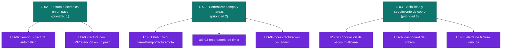

# Épicas — freelancer-tools

> Fuente única: `inbox/mvp-canvas.md`, `inbox/user-stories.md`, `inbox/requisitos.md`,
> `inbox/personas.md`, `inbox/evidence-map.json`. Toda épica traza a ítems de esas
> fuentes (ver `Origen` en cada una y en `backlog.json`).

El MVP (mvp-canvas.md) define una sola cadena de valor: **Output** (hub de
tiempo + factura + cobro, con IVA/retención automáticos, US-01 a US-08) →
**Outcome** (el freelancer deja de perder horas admin en sincronizar y
cobrar) → **Impact** (baja el % de horas semanales no facturables). Las tres
épicas de abajo descomponen ese output en tres resultados de comportamiento
distintos para el mismo segmento (freelancer solo que factura en Colombia:
Daniela, Felipe — Marcela y R-14/R-15 quedan fuera de alcance, ver
mvp-canvas.md → "Fuera de alcance").

## E-01 · Centralizar tiempo y tareas sin sincronización manual
**Valor (outcome):** El freelancer deja de perder horas facturables por
olvido de registrar tiempo y deja de gastar tiempo sincronizando tareas,
tiempo y notas entre herramientas separadas (Trello, Toggl, Sheets, Notion).
Mueve directamente la métrica de éxito del MVP: horas semanales de
administración auto-reportadas (línea base ~15-20h/45h → meta ≤13h).
**Origen:** mvp-canvas.md (funcionalidades mínimas US-01, US-03, US-04;
métrica de éxito); requisitos.md R-01, R-05, R-06; personas.md /
evidence-map.json — dolores `coordinacion-manual-herramientas`,
`time-tracking-inconsistente`, `horas-admin-no-facturables`,
`cambio-contexto-tareas` (corroborados por Daniela, Felipe y Marcela, aunque
el MVP solo se construye para freelancer solo).
**Prioridad:** 2
**Historias:** US-01, US-03, US-04

## E-02 · Convertir tiempo trabajado en factura electrónica válida en un paso
**Valor (outcome):** El freelancer genera una factura electrónica válida
ante la DIAN, con IVA y retención en la fuente calculados automáticamente a
partir del tiempo ya registrado, sin duplicar el trabajo en una hoja de
cálculo aparte y sin perder horas facturables por datos desincronizados.
Es la propuesta de valor central del MVP ("dejar de ser la integradora
humana… el tiempo se convierte directamente en una factura electrónica
válida ante la DIAN").
**Origen:** mvp-canvas.md (propuesta de valor; funcionalidades mínimas
US-02, US-05; riesgo regulatorio/técnico y riesgo de cálculo tributario);
requisitos.md R-02, R-03, R-16; personas.md / evidence-map.json — dolores
`facturacion-electronica-doble-paso`, `herramientas-no-localizadas-latam`,
`perdida-ingresos-desorganizacion` (incluye el caso de Felipe, que "regaló"
un entregable de 2 millones COP por olvidar facturarlo).
**Prioridad:** 1
**Historias:** US-02, US-05

## E-03 · Visibilidad y seguimiento de cobro hasta que el dinero llega
**Valor (outcome):** El freelancer sabe en todo momento cuánto ha
facturado, cuánto le han pagado, cuánto está pendiente y cuánto está
vencido — sin conciliar manualmente pagos por Bancolombia, Nequi o canales
internacionales ni revisar varias hojas de cálculo — y actúa a tiempo
cuando una factura vence sin pago.
**Origen:** mvp-canvas.md (funcionalidades mínimas US-06, US-07, US-08);
requisitos.md R-04, R-08, R-09; personas.md / evidence-map.json — dolores
`seguimiento-manual-pagos`, `pagos-multiples-canales-latam`,
`perdida-ingresos-desorganizacion`, `carga-mental-constante` (atendido
parcialmente, según user-stories.md → "Validación cruzada").
**Prioridad:** 3
**Historias:** US-06, US-07, US-08

## Justificación de prioridad (valor, no facilidad técnica)

1. **E-02** primero: es la propuesta de valor central del MVP y el mayor
   riesgo del proyecto a la vez (riesgo regulatorio/técnico de integración
   con la DIAN y riesgo de cálculo tributario, ambos señalados como
   condicionantes de cronograma y costo en `mvp-canvas.md`). Validar esto
   temprano reduce la mayor incertidumbre del delivery y ataca
   directamente la pérdida de ingresos real más grave documentada
   (Felipe perdió 2M COP por olvidar facturar).
2. **E-02** también depende de que exista un registro de tiempo, pero el
   riesgo/valor de la factura domina sobre la comodidad del hub — por eso
   **E-01** entra en segundo lugar: es la base operativa diaria
   (recordatorios de timer, distinción de horas facturables) que mueve
   directamente la métrica de éxito del MVP (horas admin semanales), y sin
   ella E-02 no tiene datos de tiempo consistentes que facturar.
3. **E-03** cierra el ciclo (cobro) y depende de que ya existan facturas
   generadas por E-02; su dolor (seguimiento manual de pagos) es real y
   compartido, pero solo se activa una vez que el freelancer ya está
   facturando por el sistema, por lo que se prioriza al final del núcleo.

## Diagrama del backlog

> Color: teal (`#0F766E`) = épica / historia en backlog priorizado; morado
> (`#6D28D9`) = historia candidata pendiente de refinamiento INVEST por el
> Developer (todas lo están en esta fase — ninguna ha pasado aún por
> `generate-stories`).

## Supuestos y preguntas abiertas relevantes para priorización

Estos no se afirman como hechos; quedan como preguntas abiertas para el
equipo (ver también `backlog.json` → `open_questions` por historia):

- El riesgo regulatorio de E-02 (integrarse con un proveedor tecnológico
  habilitado por la DIAN, o convertirse en uno) puede cambiar el esfuerzo
  real de US-05 de forma significativa; no está resuelto en el discovery
  (mvp-canvas.md → "Riesgos y supuestos").
- Las reglas de IVA/retención de US-05 deben validarse con alguien con
  conocimiento contable/tributario antes de construir; el discovery no
  incluye esa validación (mvp-canvas.md → "Riesgo de cálculo tributario").
- El modelo de precio (R-19) tiene evidencia en conflicto (pago único vs.
  suscripción) y no se resuelve en este backlog — no bloquea el orden de
  las épicas, pero sí una decisión de negocio pendiente (requisitos.md →
  "Evidencia conflictiva").
