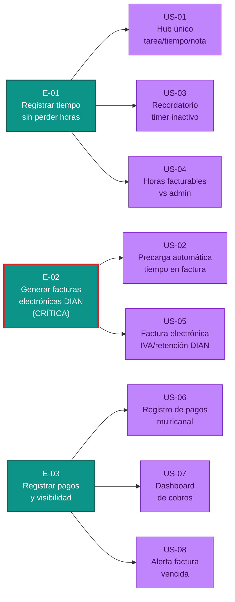

# Épicas del MVP — freelancer-tools

Descomposición del MVP en 3 épicas orientadas a outcome (comportamiento que cambia), ordenadas por valor y riesgo. Cada épica responde: "¿qué problema administrativo resuelve para qué persona?"

---

## E-01 · Registrar tiempo sin perder horas facturables por olvido

**Valor (outcome):** El freelancer registra tiempo de forma consistente y visualiza dónde se va su tiempo (facturable vs administrativo), eliminando la pérdida de ingresos por olvido de timer y ganando claridad sobre el origen de horas administrativas.

**Origen:**
- `mvp-canvas.md`: Funcionalidades mínimas US-01, US-03, US-04
- `user-stories.md`: US-01, US-03, US-04
- `requisitos.md`: R-01 (centralizar), R-05 (recordatorio), R-06 (reportería de horas)
- `personas.md`: dolores `time-tracking-inconsistente`, `horas-admin-no-facturables`, `cambio-contexto-tareas`

**Prioridad:** 2 (ALTA) — Es el fundamento del sistema. Sin un registro de tiempo confiable, la factura será incorrecta. Aunque técnicamente menos arriesgado que E-02, es bloqueante funcional. Validar que los usuarios pueden registrar tiempo sin fricción es crítico para la adopción.

**Historias:** US-01, US-03, US-04

---

## E-02 · Generar facturas electrónicas válidas en un solo paso (sin sincronización manual)

**Valor (outcome):** El freelancer convierte horas trabajadas en facturas electrónicas válidas ante la DIAN (con IVA y retención automáticos) en un solo paso, eliminando el trabajo administrativo doble (Sheets → Siigo/Alegra) y el riesgo de cálculo tributario incorrecto.

**Origen:**
- `mvp-canvas.md`: Funcionalidades mínimas US-02, US-05; Riesgo regulatorio/técnico alto (DIAN)
- `user-stories.md`: US-02, US-05
- `requisitos.md`: R-02 (tiempo → factura automático), R-03 (factura electrónica DIAN), R-16 (cumplimiento tributario colombiano)
- `personas.md`: dolores `coordinacion-manual-herramientas`, `facturacion-electronica-doble-paso`, `herramientas-no-localizadas-latam`, `perdida-ingresos-desorganizacion`

**Prioridad:** 1 (CRÍTICA) — Es el corazón del MVP y la propuesta de valor más dramática. El mayor cambio de comportamiento para el usuario (Felipe: Sheets→Siigo; Daniela: Sheets→manual). Es también el riesgo técnico/regulatorio más alto (validación DIAN, cálculo tributario, integración con proveedor habilitado). Este riesgo debe validarse lo antes posible. Sin E-02 funcionando, no hay MVP.

**Historias:** US-02, US-05

---

## E-03 · Registrar pagos y tener visibilidad de cobros en un solo lugar

**Valor (outcome):** El freelancer sabe en tiempo real cuánto ha cobrado, cuánto está pendiente y cuánto está vencido (en un solo dashboard), y recibe alertas automáticas de facturas vencidas, eliminando la carga mental de seguimiento manual y el riesgo de deudas olvidadas.

**Origen:**
- `mvp-canvas.md`: Funcionalidades mínimas US-06, US-07, US-08
- `user-stories.md`: US-06, US-07, US-08
- `requisitos.md`: R-04 (registro de pagos multicanal), R-08 (dashboard de cobros), R-09 (alerta vencida)
- `personas.md`: dolores `seguimiento-manual-pagos`, `pagos-multiples-canales-latam`, `carga-mental-constante`, `clientes-no-pagan-desaparecen` (Felipe)

**Prioridad:** 3 (MEDIA-ALTA) — Cierra el ciclo tiempo→factura→cobro. Menos arriesgado que E-02 técnicamente, pero crítico para que el freelancer confíe en el sistema y para resolver el pain point de carga mental. Sin E-03, el usuario debe seguir usando Sheets para saber qué le deben.

**Historias:** US-06, US-07, US-08

---

## Diagrama del backlog de épicas y historias

**Leyenda:**
- **Teal oscuro (E-01, E-03):** Épicas de prioridad media-alta (foundational, supportive).
- **Rojo (E-02):** Épica crítica (corazón del MVP, máximo riesgo técnico/regulatorio).
- **Verde:** Historias candidatas (pueden tener open_questions que refinará el Developer).
- **Morado:** Historias que necesitan refinamiento adicional.

---

## Justificación de priorización

La cadena de valor del MVP es **Tiempo → Factura → Cobro**. Sin embargo, la priorización no sigue el flujo de producto, sino el **riesgo y el valor**:

1. **E-02 es CRÍTICA (Prioridad 1)** porque:
   - Es la propuesta de valor más disruptiva (cambio máximo de flujo de trabajo).
   - Concentra el riesgo más alto del MVP: cumplimiento DIAN, integración con proveedor habilitado, cálculo tributario sin errores.
   - Sin E-02, no hay MVP. Es el primer gate que debe pasar.
   - Las otras épicas son supportive: no importa cuán bueno sea el timer (E-01) o la visibilidad de cobros (E-03) si la factura no es válida ante la DIAN.

2. **E-01 es ALTA (Prioridad 2)** porque:
   - Es el input del sistema. Tiempo incorrecto = factura incorrecta.
   - Menos arriesgado que E-02, pero bloqueante funcional.
   - Valida la aceptación del flujo básico (gestionar tarea, registrar tiempo) antes de meterse en la complejidad tributaria.

3. **E-03 es MEDIA-ALTA (Prioridad 3)** porque:
   - Cierra el ciclo y da confianza al usuario.
   - Menos arriesgado que E-02 o E-01.
   - Sin E-03, el usuario debe seguir usando Sheets; con E-03, tiene un único lugar de verdad.
   - US-08 (alerta vencida) es particularmente valiosa para Felipe (que perdió cobros).

